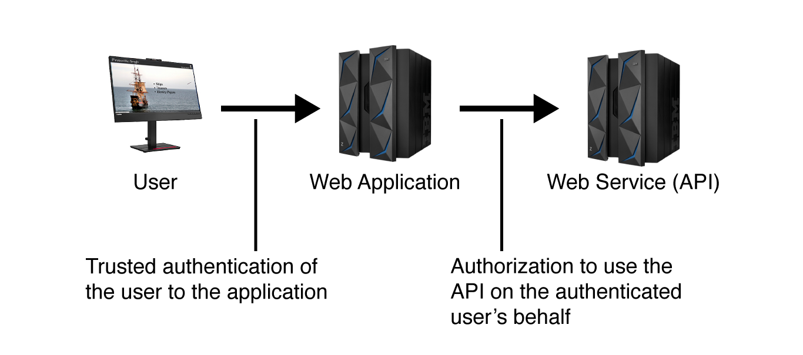
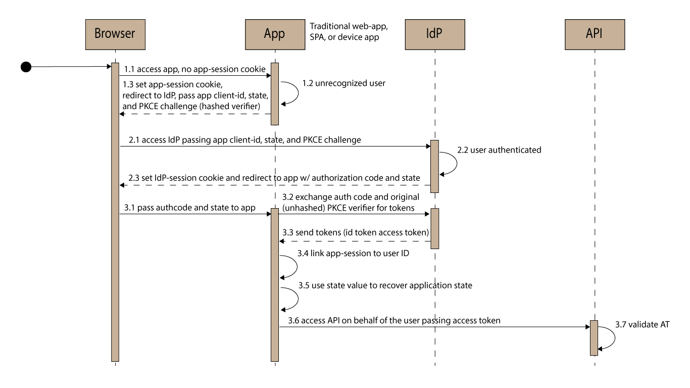
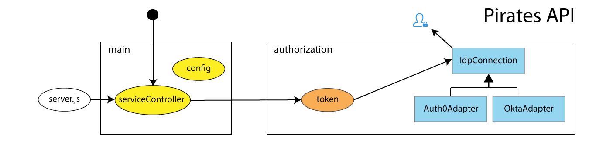
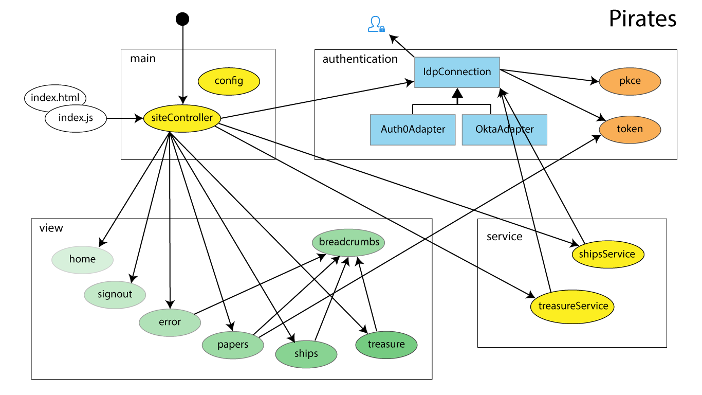

# Pirates: a Client-Side OAuth/OIDC Adventure

## Overview

Managing user authentication and API authorization is a fundamental goal in single-page and native client-side applications,
OAuth and OpenID Connect are the answer!
Pirates is a simple, clean single-page application to demonstrate decoupling identity from an application
by adding the functionality of an identity provider (IdP) with federated (shared and trusted) user
authentication across multiple applications.

If you are trying to demonstrate to a group how to do this, Pirates provides a solution and the foundation for an
interactive demonstration to do this.
If you are looking for a clean example to follow, Pirates implements a vendor-neutral
OAuth Authorization Code Flow with PKCE (Proof Key Code Exchange) to demonstrate how authentication and authorization work.
A brief overview of the application is below, detailed topics and lab/demo instructions are in the associated guide:
contribute to [my coffee fund](#mycoffeefund) and contact me at mailto:joelmussman@gmail.com and I'll give you a copy!

Pirates is built using basic JavaScript with fundamental REST calls
to clearly explain and demonstrate how OpenID Connect authentication and OAuth authorization work:

There are two pieces to *Pirates*:
a single-page web application (SPA) that interfaces with the user and a web service (API) that the SPA connects to.
*Pirates* requires both authentication and authorization:
authentication to identify the user and authorization to let the user into private areas and for the application
to use the API on behalf of the authenticated user.
Both projects are kept in this repository to make management of the demonstration simple.
The *pirates* project is a javascript-based single-page application built with webpack.
The *pirates-api* project is a javascript-based NodeJS project, also built with webpack.

## Usage and Demonstration

There are two branches in the repository: *master* and *demo*.
Use the demo branch for demonstrations.
The applications (SPA and API) are completely written except for authentication and authorization.
Some supporting code for authentication and authorization is present and working to speed up the demonstration, but the
focus is on adding in the primitive REST operations to implement the flow.
The master branch is complete and will work after setting the IdP values in main/config for both projects (see the [Configuration](#Configuration) section below).

The master branch is suitable for reviewing the working authentication and authorization code.
The examples in the discussion of key points below are taken from this branch.

Start a demonstration by spinning up the service and the application.
The application and the service work, but the /treasure endpoint in the service is not protected, and there is nothing show for 'Identity Papers' in the client.

Work through the client to add the missing pieces of authentication and get to the point where Identity Papers works, but you
have not obtained an access token for the Pirates API.
Add the authorization requirement to the API, show that it isn't working in the client because we don't have the token.
Change the client to get the access token on authorization asking for the scopes read:ships and read:treasure,
and then show the service responds to the request for /treasure.

**See also:** the [Configuration](#Configuration) section below to set up the projects and the identity provider.

## Project Overview

### Authorization Code Flow with PCKE

The application uses (or will use after the demo) the OAuth *Authorization Code Flow with PCKE* (Proof Key Code Exchange) to authenticate the
user and receive an ID token to identify the user and an access token to authorize requests to the API:

In this flow the application redirects the browser to the IdP to authenticate, passing it the ID of the application
a hashed verifier code called the *challenge*, the scopes that define what tokens and claims are requested,
the path to redirect the authenticated user to, and the state the user should land at after authentication is complete.

When the user is authenticated the IdP sends the browser back to that redirect path in the application
to continue the flow, passing it an *authorization code* that may be exchanged for the tokens.
The application uses AJAX to make a second request to the IdP without involving the browser,
passing it the authorization code and the PKCE verifier to prove it is the same initiator.
When the IdP validates the code and verifier it sends back the tokens requested.

The authorization code allows the IdP to pass the tokens without using the browser address bar (Implicit Flow) and allowing them to be captured by seeing them in the browser window or
letting them to be cached in the browser history.

PKCE allows the IdP to verify that the authorization code is coming from the same
application that made the original request (the holder of verifier).
PKCE is the only way that SPA applications can be trusted, since a client secret cannot be put on an end-user
computer or device.

Once the application has an access token it can use it to authorize requests to an API.

#### Security notes

If you have security concerns consider these points:

* All client communication must be TLS encrypted (HTTPS), except for development applications in the http://localhost domain.
* The user is being authenticated, not the application.
We have minimal concerns about authenticating the application (see the next point).
* The identity provider will only accept and redirect the user to a registered URI for the second part of the flow,
so it has to be the application that receives the authorization code.
A fake application could initiate the flow but without the verifier the true application cannot complete it,
so what is the point to do that?
* The client ID does not need to be protected because of the previous points.
* A client secret is not necessary because PKCE is used to ensure same client is completing the second part of the flow.
* The authorization code eliminates the problem of token leakage by someone seeing the browser address bar or looking at the browser history.
* Even if malware could find the verifier and catch the authorization code in the browser redirect there is a very,
very short window of opportunity to beat the application to the tokens.
No solution is perfect, the goal is to minimize the risk as much as possible and this flow does it very well.

### Pirates API

The structure of the *Pirates API* is organized into two sections: *main* and *authorization*:
The entry point is *server.js*, which launches a simple *Express* server in *serviceController*.

The "found message" connection with the black dot shows HTTP requests entering the module.
serviceController uses the *token* module to validate the access token delivered from the client application.
Token uses a subclass of *IdpConnection* to get the keys from the appropriate identity provider (IdP),
the blue locked identity icon above *authorization*.

The IdpConnection structure follows the Gang of Four (GoF) *Adapter Pattern*: extend IdpConnection into
a new subclass to support new identity providers.

The *config* module defines the port this service should listen on, the URL to the identity provider,
the audience that should appear in the access token, the name of the claim for permissions in the access token,
and the instance of the IdpConnection subclass to use when the token module gets the public keys from the IdP.

    import OktaAdapter from 'authorization/OktaAdapter';

    const authorizationServerUri = 'https://dev-XXXXXXXX.okta.com/oauth2/aussqx0ajlGLJ20iU5d6/v1';
    const idpConnection = new OktaAdapter();
    const tokenPermissionsClaim = 'scp';
    const apiPort = 8000;
    const apiAudience = `http://localhost:${apiPort}`;

    export { apiAudience, apiPort, authorizationServerUri, idpConnection, tokenPermissionsClaim };

Import statements are used to inject these values into the serviceController, token, and IdpConnection modules.

    import { idpConnection, tokenPermissionsClaim } from 'main/config';

The express engine returns hardwired lists of ships and treasure, it is a simple solution for the purposes of the demonstration.

### Pirates

The SPA is organized into the sections main, view, authentication, and service:

Most of the modules act as singletons and export functions in the modern style.
IDPConnection is a class class that implements the GoF *Template Method* pattern:
the core processes are implemented in the super-class which delegates the variances
to communicate with the IdP to the subclasses.

#### Single-Page Application

The SPA does not use any framework to avoid complicating the example.
The *index* module is loaded from *index.html* and launches *siteController*, the found messages are
the HTTP requests that drive *siteController*.
The *siteController* uses the *location.pathname* to determine state.
The module overrides the *history.pushState* method to create an event every time the
path is changed, and an event handler is attached that calls siteController on each occurrence.
This is the same method used by the frameworks: React, Angular, Vue, etc.:

    const oldPushState = history.pushState;

    history.pushState = (state, title, url) => {

        oldPushState.call(history, state, title, url);
        dispatchEvent(new Event('statechanged'));
    }

    // Set up the route handler to trigger state changes on hash update.

    $(window).on('statechanged', () => {

        siteController();
    });

#### siteController

The siteController function gets the requested path from the location object and decides how to
respond: what to do next, handle authentication if necessary, what view to show, how to display errors.

    let state = location.pathname;

    switch (state) {
        case '/':
            home();
            break;
        
        case '/treasure':
            await idpConnection.authenticate(state);
            let leaderBoard = await readTreasure();
            treasure(leaderBoard);
            break;

The second half of Authorization Code Flow with PKCE must back to the SPA because the
verify value is needed to perform the AJAX request.
In order for that to happen the web server delivering the application must be configured
to avoid seeing the /authorize path as a 404 and load the SPA anyways.
The *signout* view is used to toggle the sign-in/sign-out link in the page header.

        case '/authorize':
            let landingState = await idpConnection.authorize()
            signout(true);
            history.pushState({}, '', landingState);
            break;

#### Views

The view modules are logic that produce the presentation for the user and are separate from
the "business logic" of deciding what to do or manipulating data.
The controller decides which view logic should be used or combined together to build the presentation.

    const papers = () => {

        let content = breadcrumbs('Identity Papers');
        let [ idToken, accessToken, refreshToken ]
            = idpConnection.getTokens();
        
        if (idToken) {

            let idTokenPayload = JSON.stringify(getPayload(idToken),
                undefined, 4);

            content
                .append($('
', { class: 'codeblock' })
                    .append($('<h1>').append('ID Token'))
                    .append(idTokenPayload));

#### Authentication and Authorization Logic

The authentication and authorization logic are contained in the IdpConnection class.
The variation between identity providers is built into the subclass used.
The main/config module injects the correct subclass into the siteController.

    async authenticate(state) {

        setVerifier();
        location.href = this._authCodeFlowWithPkceUri(state);
    }

    async authorize() {

        const params = (new URL(document.location)).searchParams;

        if (params.get('error')) {

            throw new Error(`Authentication error: ${params.get('error_description')}`);
    
        } else {

            await this._requestTokens(params.get('code'));
            return params.get('state');
        }
    }

Note that only the query string parameters are searched on the *authorize* side of the
flow; for some IdPs (Okta) it is necessary to make sure that the
'response_mode=query' parameter
is set in the authentication request for the data to appear there (that would be a feature
in the IdpConnection subclass).

Handling the token response is done in *_requestTokens()*.
This super-class method is the same for all identity providers; the
AJAX query string is built by the method in the subclass.
requestTokens is separated
from *authorization* so that it can build a setTimeout call with itself to refresh
the tokens before they expire:

    try {

        let res = await $.ajax(this._requestTokensAjaxConfig(authorizationCode));

        this._idToken = res.id_token;
        this._accessToken = res.access_token;
        this._refreshToken = res.refresh_token;

#### PKCE: Cross-Page Logic and Security

A main feature of the flow is that the browser leaves the application to go to the IdP, and the application
is reloaded when the browser returns.
The SPA needs to start at the path indicated by the redirect path, complete the flow, and then move to the *state*
that was decided before the flow began.
The state was passed through the flow, but what about any data that needed to be preserved across the unload
and reload of the SPA?
What about the verifier needed for the AJAX request after the SPA reload?

Before authentication the SPA should have minimal knowledge or state for the user, so
if done correctly no real data should have to be saved, except for the verifier.

It is important to understand that any persistent storage is outside the browser and susceptible
to other applications finding it (malware).
That includes cookies with an expiration date and local storage.

But it is also necessary to understand that it is impossible to not send cookies back to the server,
so the redirect to finish authorization will make that happen.
Even if an encrypted connection is ensured (a secure cooke) the server will see the application client id,
the authorization code, and the verifier.
That provides the server a window of opportunity to act on the information before returning the SPA page to
the browser to perform its AJAX call.
Can the server be trusted?

So the best solution is to use local storage.
Even though hacking persistent local storage is possible, malware needs to capture the authorization code in the response to the browser
and act on it before the javascript in the browser does.
That is a very, very short window, and if it does happen the authentication
in the application will not succeed which should raise a flag that something is wrong.

    const base64URLEncode = (str) => {

        return str.toString('base64').replace(/\+/g, '-').replace(/\//g, '_').replace(/=/g, '');
    }

    const setChallenge = () => {

        challenge = base64URLEncode(crypto.createHash('sha256').update(verifier).digest());
    }

    const setVerifier = () => {

        verifier = base64URLEncode(crypto.randomBytes(32));
        localStorage.setItem(pkceName, verifier);
        setChallenge();
    }

    const pkceName = 'pkce.verifier';
    let challenge;
    let verifier = localStorage.getItem(pkceName);

    verifier ? setChallenge() : setVerifier();

The module loads the verifier on module load, and if found sets the hashed challenge or if not
creates a new verifier and hashed challenge.
The authentication function in IdpConnection will always set a new verifier before starting an
authentication flow to reduce the window of opportunity for malware to find the right one to a minimum.

## Project Configuration

Knowledge of GitHub, JavaScript (ES6+), NodeJS, Node packages, webpack, and an identity provider such as Okta or Auth0 is required.
The ability to configure the identity provider is presumed.

If you just want to review a functioning copy of the application without configuring an IdP, these two tenants are available.
They will work with the login names defined in the [Pirates of the Caribbean](https://github.com/jmussman/piratesofthecaribbean)
project and the password "P!rates17".
They are locked down, you can't get into them or change the passwords of any of the users, and the users won't lock out.
You can use them for authentication and access tokens *IF* you do not change the application and API URLs:

#### Okta

* Client id: 0oasqz7cmOGojO08G5d6
* Authorization server URI: https://dev-77167726.okta.com/oauth2/aussqx0ajlGLJ20iU5d6/v1
* Access token permissions claim: "scp"

#### Auth0

* Client id: 1RO60K1qAtexVy8PgKogLXlIsHLwGHw7
* Authorization server URI: https://dev-t-i2cj7t.us.auth0.com
* Access token permissions claim: "permissions"

### Configuring an Identity Provider

The example should work with any OIDC/OAuth 2 compliant IdP; a new development tenant at Okta or Auth0
is a common platform to use.
As the settings are exposed in the IdP add them to the main/config.js modules in both Pirates and Pirates API.

To configure the IdP:

1. Create users and groups for the identities the application will use. Look at the
[Pirates of the Caribbean](https://github.com/jmussman/piratesofthecaribbean) project on GitHub
for the users and groups that were used when this project was built.
1. Configure an application for the SPA with the signon redirect URL (default: http://localhost:9000/authorize).
1. Add an authorization server for the API. Add the application as a trusted origin (default: http://localhost:9000).
1. Set the API URL as the target audience (default: http://localhost:8000).
1. Set two private scopes into authorization service that the application will use:
*read:ships* and *read:treasure*.
1. Allow the *crew* group access to the API, more importantly make sure the *hunters* and
*ship rats* groups are blocked from accessing the API.
1. Set the authorization server to use refresh token rotation.

### Configuring the Pirates API and Pirates projects

1. Clone this GitHub project. To see the working code stay on the *master* branch. To run a demonstration switch to the *demo* branch which does not have authentication and authorization configured.
1. For both projects create a new subclass of IdpConnection for identity providers other than Okta and Auth0 if needed.
1. Update the main/config.js file with the authorization server URI and the name of the
permissions claim in the access token.
1. In the Pirates project update main/config.js with the client ID.
1. For both projects in main/config.js import and assign to idpConnection an instances of the subclass that
handles the variations for the IdP.

### Running the Pirates API and the Pirates Application

Both the SPA and API are configured in a **webpack** environment  server that recompiles and reloads on file changes.
Both projects may be started with *npm start* at the command line.

Start the API and check it by browsing to the ships endpoint: http://localhost:8000/ships by default.
Launch the application, and open it in a browser: http://localhost:9000 by default.
If you are on the master branch and everything is configured correctly it will work.

For demonstrations follow the detailed topics and instructions in the associated guide:
contribute to [my coffee fund](#mycoffeefund) and contact me at mailto:joelmussman@gmail.com and I'll give you a copy!

## My Coffee Fund

Since I give this away for free, and if you would like to keep seeing more things like this, then please consider
a contribution to *Joel's Coffee Fund* at **Smallrock** to help keep the good stuff coming :) 

## License

The code is licensed under the MIT license.
You may use and modify all or part of it as you choose, as long as attribution to the source is provided per the license.
See the details in the [license file](./LICENSE.md) or at the [Open Source Initiative](https://opensource.org/licenses/MIT)

Copyright © 2021 Joel Mussman. All rights reserved.